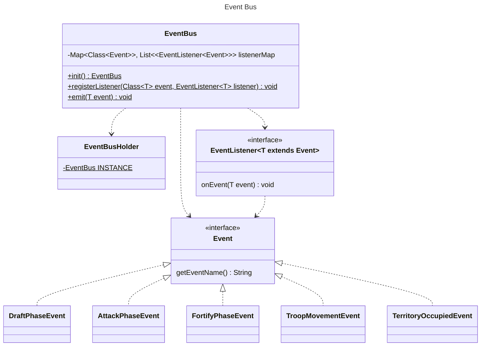

```mermaid
---
title: Event Bus
---

classDiagram
    class EventBus {
        -Map~Class~Event~~, List~~EventListener~Event~~~ listenerMap
        
        +init() EventBus$
        +registerListener(Class~T~ event, EventListener~T~ listener) void$
        +emit(T event) void$
    }
    class EventBusHolder {
        -EventBus INSTANCE$
    }
    class Event {
        <<interface>>
        getEventName() String
    }
    class EventListener~T extends Event~ {
        <<interface>>
        onEvent(T event) void
    }
    
    EventBus ..> EventBusHolder
    EventBus ..> Event
    EventBus ..> EventListener
    EventListener ..> Event
    
    Event <|.. DraftPhaseEvent
    Event <|.. AttackPhaseEvent
    Event <|.. FortifyPhaseEvent
    Event <|.. TroopMovementEvent
    Event <|.. TerritoryOccupiedEvent
```
