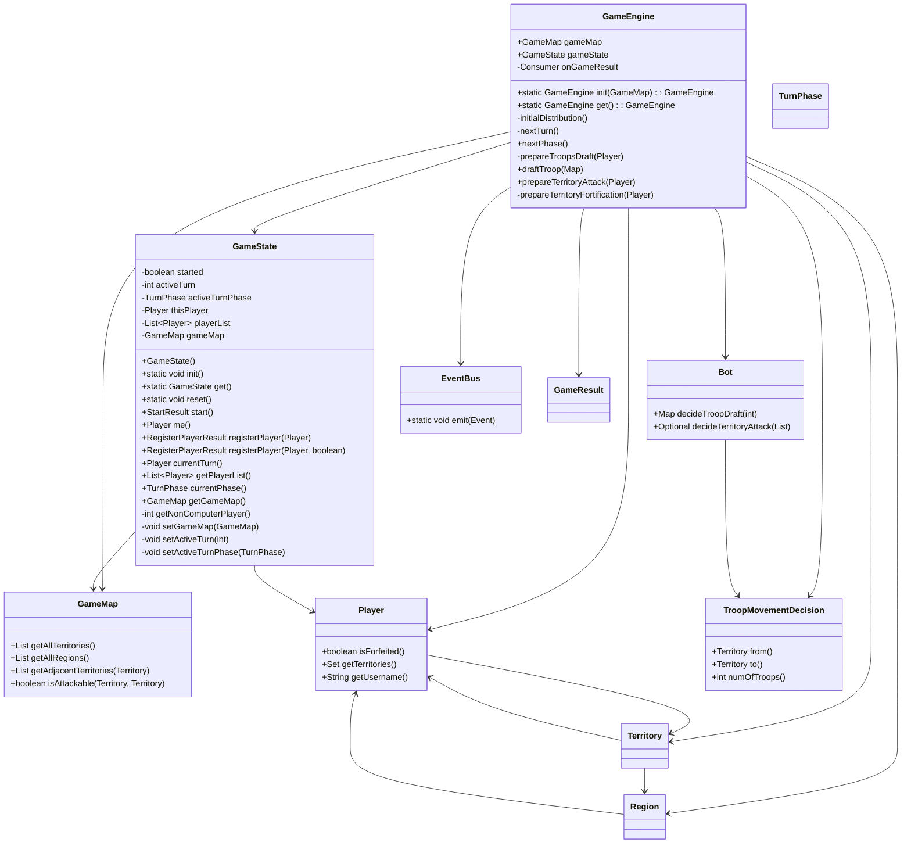

```mermaid
classDiagram
    class GameEngine {
        +GameMap gameMap
        +GameState gameState
        -Consumer<GameResult> onGameResult
        +static GameEngine init(GameMap): GameEngine
        +static GameEngine get(): GameEngine
        -initialDistribution()
        -nextTurn()
        +nextPhase()
        -prepareTroopsDraft(Player)
        +draftTroop(Map<Territory, Integer>)
        +prepareTerritoryAttack(Player)
        -prepareTerritoryFortification(Player)
    }

    class GameMap {
        +List<Territory> getAllTerritories()
        +List<Region> getAllRegions()
        +List<Territory> getAdjacentTerritories(Territory)
        +boolean isAttackable(Territory, Territory)
    }

    class GameState {
        -boolean started
        -int activeTurn
        -TurnPhase activeTurnPhase
        -Player thisPlayer
        -List~Player~ playerList
        -GameMap gameMap
        +GameState()
        +static void init()
        +static GameState get()
        +static void reset()
        +StartResult start()
        +Player me()
        +RegisterPlayerResult registerPlayer(Player)
        +RegisterPlayerResult registerPlayer(Player, boolean)
        +Player currentTurn()
        +List~Player~ getPlayerList()
        +TurnPhase currentPhase()
        +GameMap getGameMap()
        -int getNonComputerPlayer()
        -void setGameMap(GameMap)
        -void setActiveTurn(int)
        -void setActiveTurnPhase(TurnPhase)
    }


    class Territory {
    }

    class Region {
    }

    class Player {
        +boolean isForfeited()
        +Set<Territory> getTerritories()
        +String getUsername()
    }

    class Bot {
        +Map<Territory, Integer> decideTroopDraft(int)
        +Optional<TroopMovementDecision> decideTerritoryAttack(List<Territory>)
    }

    class EventBus {
        +static void emit(Event)
    }

    class TurnPhase

    class GameResult

    class TroopMovementDecision {
        +Territory from()
        +Territory to()
        +int numOfTroops()
    }

    %% Relationships
    GameEngine --> GameMap
    GameEngine --> GameState
    GameEngine --> EventBus
    GameEngine --> GameResult
    GameEngine --> Player
    GameEngine --> Bot
    GameEngine --> Territory
    GameEngine --> Region
    GameEngine --> TroopMovementDecision
    GameState --> GameMap
    GameState --> Player
    Player --> Territory
    Territory --> Player
    Territory --> Region
    Region --> Player
    Bot --> TroopMovementDecision
```
