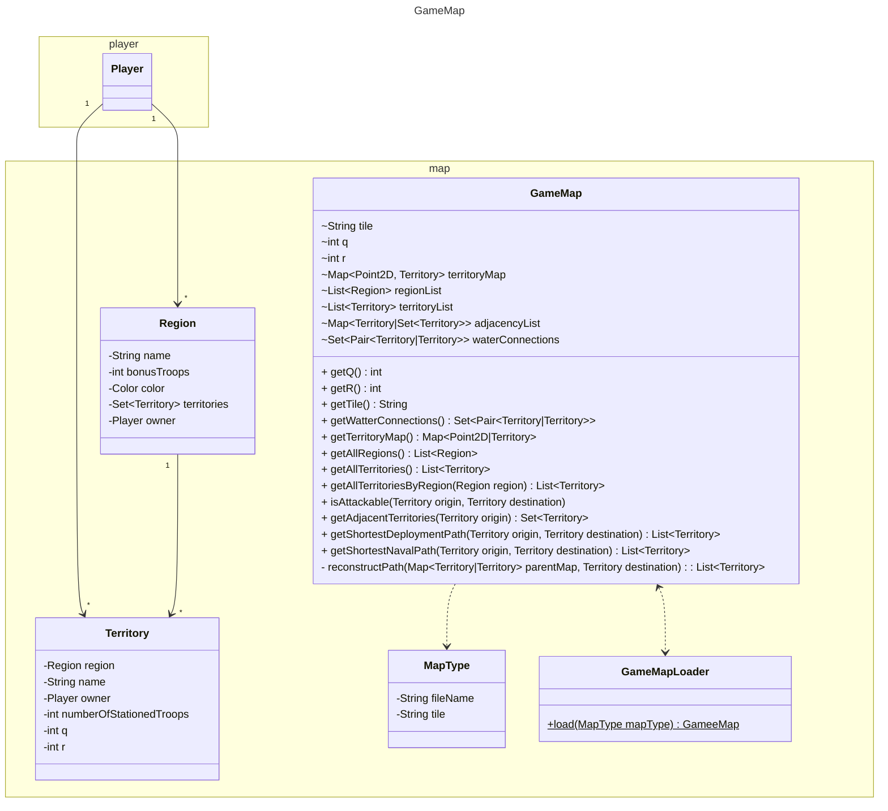

```mermaid
---
title: GameMap
---

classDiagram
    namespace player {
        class Player {
        }
    }
    namespace map {
        class Region {
            -String name
            -int bonusTroops
            -Color color
            -Set~Territory~ territories
            -Player owner
        }
        class Territory {
            -Region region
            -String name
            -Player owner
            -int numberOfStationedTroops
            -int q
            -int r
        }
        class MapType {
            -String fileName
            -String tile
        }
        class GameMapLoader {
            +load(MapType mapType) GameeMap$
        }
        class GameMap {
            ~String tile
            ~int q
            ~int r
            ~Map~Point2D, Territory~ territoryMap
            ~List~Region~ regionList
            ~List~Territory~ territoryList
            ~Map~Territory|Set~Territory~~ adjacencyList
            ~Set~Pair~Territory|Territory~~ waterConnections
            
            + getQ() int
            + getR() int
            + getTile() String
            + getWatterConnections() Set~Pair~Territory|Territory~~
            + getTerritoryMap() Map~Point2D|Territory~
            + getAllRegions() List~Region~
            + getAllTerritories() List~Territory~
            + getAllTerritoriesByRegion(Region region) List~Territory~
            + isAttackable(Territory origin, Territory destination)
            + getAdjacentTerritories(Territory origin) Set~Territory~
            + getShortestDeploymentPath(Territory origin, Territory destination) List~Territory~
            + getShortestNavalPath(Territory origin, Territory destination) List~Territory~
            - reconstructPath(Map~Territory|Territory~ parentMap, Territory destination) : List~Territory~ 
        }
    }
    
    Player "1" --> "*" Region
    Player "1" --> "*" Territory
    Region "1" --> "*" Territory
    GameMap <..> GameMapLoader
    GameMap ..> MapType
```
