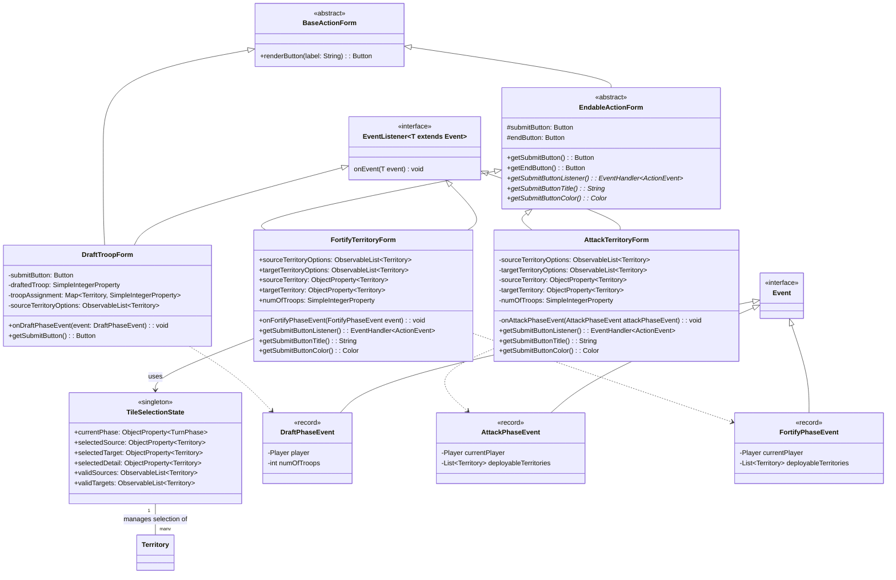

```mermaid
classDiagram
    class BaseActionForm {
        <<abstract>>
        +renderButton(label: String): Button
    }
    
    class EndableActionForm {
        <<abstract>>
        #submitButton: Button
        #endButton: Button
        +getSubmitButton(): Button
        +getEndButton(): Button
        +getSubmitButtonListener(): EventHandler~ActionEvent~*
        +getSubmitButtonTitle(): String*
        +getSubmitButtonColor(): Color*
    }
    
    class DraftTroopForm {
        -submitButton: Button
        -draftedTroop: SimpleIntegerProperty
        -troopAssignment: Map~Territory, SimpleIntegerProperty~
        -sourceTerritoryOptions: ObservableList~Territory~
        +onDraftPhaseEvent(event: DraftPhaseEvent): void
        +getSubmitButton(): Button
    }

    class AttackTerritoryForm {
        -sourceTerritoryOptions: ObservableList~Territory~
        -targetTerritoryOptions: ObservableList~Territory~
        -sourceTerritory: ObjectProperty~Territory~
        -targetTerritory: ObjectProperty~Territory~
        -numOfTroops: SimpleIntegerProperty
        -onAttackPhaseEvent(AttackPhaseEvent attackPhaseEvent): void
        +getSubmitButtonListener(): EventHandler~ActionEvent~
        +getSubmitButtonTitle(): String
        +getSubmitButtonColor(): Color
    }

    class FortifyTerritoryForm {
        +sourceTerritoryOptions: ObservableList~Territory~
        +targetTerritoryOptions: ObservableList~Territory~
        +sourceTerritory: ObjectProperty~Territory~
        +targetTerritory: ObjectProperty~Territory~
        +numOfTroops: SimpleIntegerProperty
        +onFortifyPhaseEvent(FortifyPhaseEvent event): void
        +getSubmitButtonListener(): EventHandler~ActionEvent~
        +getSubmitButtonTitle(): String
        +getSubmitButtonColor(): Color
    }

    class TileSelectionState {
        <<singleton>>
        +currentPhase: ObjectProperty~TurnPhase~
        +selectedSource: ObjectProperty~Territory~
        +selectedTarget: ObjectProperty~Territory~
        +selectedDetail: ObjectProperty~Territory~
        +validSources: ObservableList~Territory~
        +validTargets: ObservableList~Territory~
    }
    
    class Event {
        <<interface>>
    }
    class EventListener~T extends Event~ {
        <<interface>>
        onEvent(T event) void
    }
    class DraftPhaseEvent {
        <<record>>
        -Player player
        -int numOfTroops
    }
    class AttackPhaseEvent {
        <<record>>
        -Player currentPlayer
        -List~Territory~ deployableTerritories
    }
    class FortifyPhaseEvent {
        <<record>>
        -Player currentPlayer
        -List~Territory~ deployableTerritories
    }

    Event <|-- DraftPhaseEvent
    Event <|-- AttackPhaseEvent
    Event <|-- FortifyPhaseEvent
    DraftTroopForm ..> DraftPhaseEvent
    AttackTerritoryForm ..> AttackPhaseEvent
    FortifyTerritoryForm ..> FortifyPhaseEvent
    
    EventListener <|-- DraftTroopForm
    EventListener <|-- AttackTerritoryForm
    EventListener <|-- FortifyTerritoryForm
    BaseActionForm <|-- EndableActionForm
    BaseActionForm <|-- DraftTroopForm
    EndableActionForm <|-- AttackTerritoryForm
    EndableActionForm <|-- FortifyTerritoryForm
    TileSelectionState "1" -- "many" Territory : manages selection of
    FortifyTerritoryForm --> TileSelectionState : uses
```
