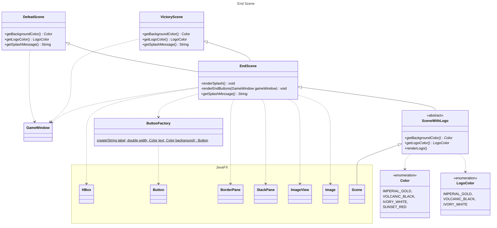

```mermaid
---
title: End Scene
---

classDiagram
    namespace JavaFX {
        class HBox 
        class Button
        class BorderPane
        class StackPane
        class ImageView
        class Image
        class Scene
    }
    
    class GameWindow
    class Color {
        <<enumeration>>
        IMPERIAL_GOLD,
        VOLCANIC_BLACK,
        IVORY_WHITE,
        SUNSET_RED
    }
    class LogoColor {
        <<enumeration>>
        IMPERIAL_GOLD,
        VOLCANIC_BLACK,
        IVORY_WHITE
    }
    class ButtonFactory {
        create(String label, double width, Color text, Color background) Button$
    }
    class SceneWithLogo {
        <<abstract>>
        +getBackgroundColor() Color*
        +getLogoColor() LogoColor*
        +renderLogo()
    }
    class EndScene {
        -renderSplash() void
        -renderEndButtons(GameWindow gameWindow) void
        +getSplashMessage() String*
    }
    class VictoryScene {
        +getBackgroundColor() Color
        +getLogoColor() LogoColor
        +getSplashMessage() String
    }
    class DefeatScene {
        +getBackgroundColor() Color
        +getLogoColor() LogoColor
        +getSplashMessage() String
    }
    
    SceneWithLogo <|-- Scene
    
    EndScene <|-- SceneWithLogo
    EndScene ..> GameWindow
    EndScene ..> HBox
    EndScene ..> ButtonFactory
    EndScene ..> BorderPane
    EndScene ..> StackPane
    EndScene ..> ImageView
    EndScene ..> Image
    ButtonFactory ..> Button
    
    VictoryScene <|-- EndScene
    VictoryScene ..> GameWindow
    
    DefeatScene <|-- EndScene
    DefeatScene ..> GameWindow
    
    SceneWithLogo ..> Color
    SceneWithLogo ..> LogoColor
```
