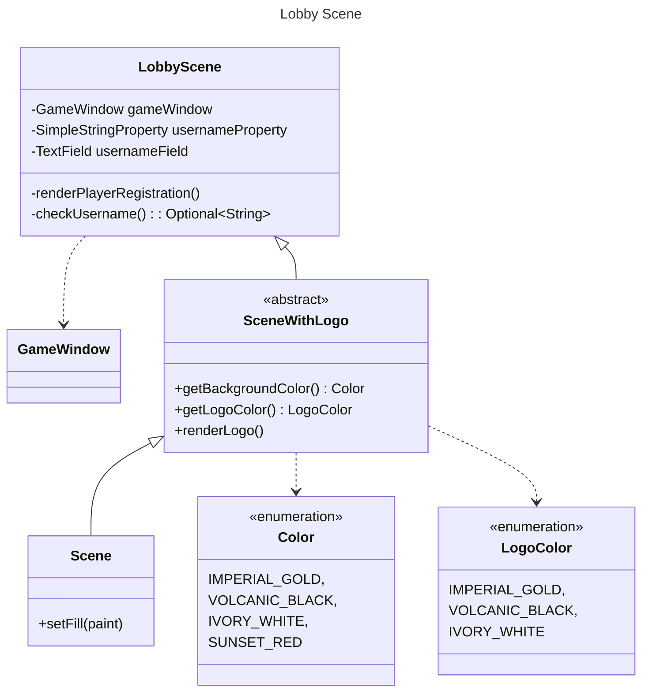

```mermaid
---
title: Lobby Scene
---

classDiagram
    class GameWindow
    class Color {
        <<enumeration>>
        IMPERIAL_GOLD,
        VOLCANIC_BLACK,
        IVORY_WHITE,
        SUNSET_RED
    }
    class LogoColor {
        <<enumeration>>
        IMPERIAL_GOLD,
        VOLCANIC_BLACK,
        IVORY_WHITE
    }
    class Scene {
        +setFill(paint)
    }
    class SceneWithLogo {
        <<abstract>>
        +getBackgroundColor() Color
        +getLogoColor() LogoColor
        +renderLogo()
    }
    class LobbyScene {
        -GameWindow gameWindow
        -SimpleStringProperty usernameProperty
        -TextField usernameField
        -renderPlayerRegistration()
        -checkUsername() : Optional~String~
    }
    
    SceneWithLogo <|-- Scene
    LobbyScene <|-- SceneWithLogo
    LobbyScene ..> GameWindow
    SceneWithLogo ..> Color
    SceneWithLogo ..> LogoColor
```
